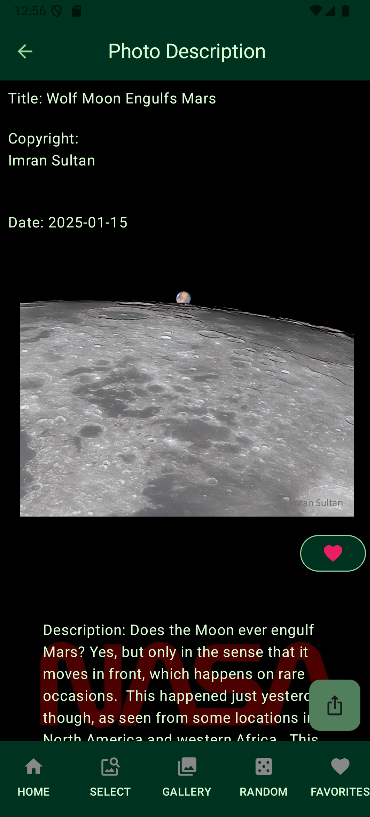

 

# 🌌 NASA APOD Gallery

Welcome to the **NASA APOD Gallery**! This application provides a seamless and visually stunning experience to explore NASA's Astronomy Picture of the Day (APOD) collection. Users can browse, favorite, and share breathtaking images and videos from the depths of the cosmos.

## 🚀 Features

- 🌠 **Photo of the Day**: Automatically displays NASA's Astronomy Picture of the Day.
- 📅 **Date Range Selection**: View photos from a specific date range with a user-friendly interface.
- ❤️ **Favorites**: Save your favorite photos and access them in a dedicated gallery.
- 🔀 **Random Photos**: Discover random APOD images with a single tap.
- 🔍 **Detail View**: Dive into each photo's details, including explanations, copyright, and more.
- 📤 **Share Photos**: Share your favorite APOD images with friends directly from the app.
- 📱 **Responsive Design**: Fully compatible with compact, medium, and expanded screen sizes for a consistent experience across devices.

## 🛠️ Technologies

- **Jetpack Compose**: Modern toolkit for building native UI.
- **Room Database**: Local storage for caching APOD data.
- **Retrofit**: Networking library for consuming NASA's APOD API.
- **ViewModel**: State management for UI components.
- **LiveData/Flow**: Reactive data streams to keep the UI updated.
- **Coroutines**: Efficient threading and asynchronous programming.
- **Hilt**: Dependency injection for cleaner and scalable code.

## 📚 Learning Objectives

- Build an Android application from the ground up
- Deepen understanding of Jetpack Compose for building dynamic and responsive UIs.
- Gain experience in implementing Room for local data storage and persistence.
- Learn best practices for consuming REST APIs with Retrofit and Coroutines.
- Understand state management with ViewModel, LiveData, and Flow.
- Integrate dependency injection using Hilt for modular and testable architecture.


## 🛠️ Setup

1. Clone the repository
2. Open the project in Android Studio.
3. Add your NASA API key to the local.properties file (if you do not have an APIKEY it will use the demo by default)
- Add:
```
nasaApiKey=*yourapikey*
```

## 🖥️ Screenshots

  

*Caption: Showcase of the gallery screens.*

  
*Caption: Detailed view of an APOD photo.*


# Youtube Video Overview

[](https://www.youtube.com/shorts/x_o7ymNO-Cc)

# Resources

## NASA APOD
https://apod.nasa.gov/apod/archivepix.html

## API Reference
https://api.nasa.gov/

## Hubble Deep Field
https://esahubble.org/images/heic0611b/
